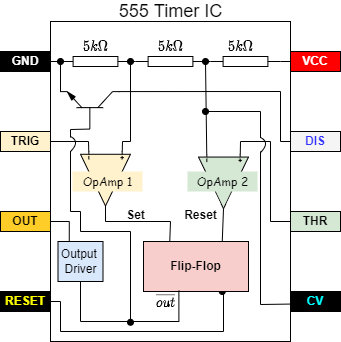

# Modes of Oscillations using 555 Timer 
  This project explains the different oscillations that can be made from 555 Timer IC namely.
- Monostable Mode
- Bistable Mode 
- Astable Mode
The above mentioned modes are self explanatory.

---

## Working principle of 555 timer IC

First lets see the internal circuit of the 555 timer IC

  

- The voltage divider consists of three identical 5k resistors which create two reference voltages at 1/3 and 2/3 of the supplied voltage, which can range from 5 to 15V.
- The Second comparator negative input terminal is connected to the 2/3 reference voltage at the voltage divider and the external “control” pin, while the positive input terminal to the external “Threshold” pin.
- On the other hand, the first comparator negative input terminal is connected to the “Trigger” pin, while the positive input terminal to the 1/3 reference voltage at the voltage divider.
- So using the three pins, Trigger, Threshold and Control, we can control the output of the two comparators which are then fed to the R and S inputs of the flip-flop.
- The flip-flop will output 1 when R(Reset) is 0 and S(Set) is 1, and vice versa, it will output 0 when R (Reset) is 1 and S(Set) is 0. Additionally the flip-flop can be reset via the external pin called “Reset” which can override the two inputs, thus reset the entire timer at any time.
- The Q-bar output of the flip-flip goes to the output stage or the output drivers which can either source or sink a current of 200mA to the load. The output of the flip-flip is also connected to a transistor that connects the “Discharge” pin to ground.